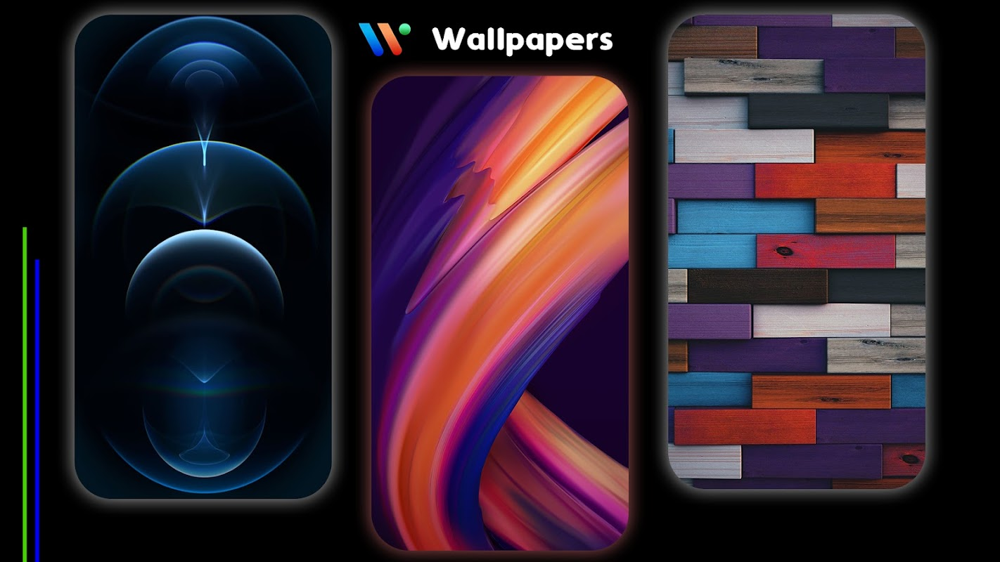
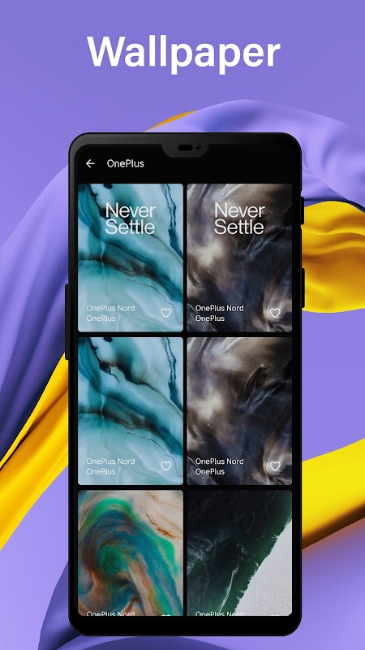
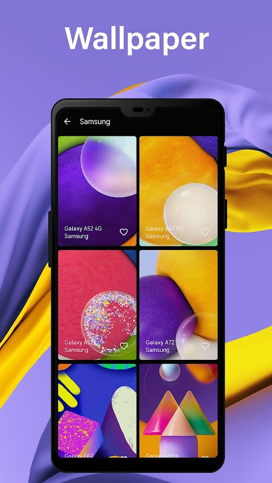
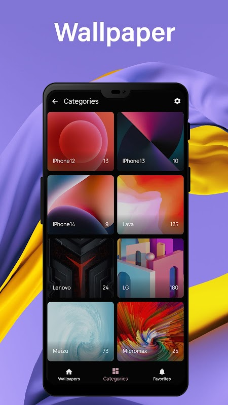
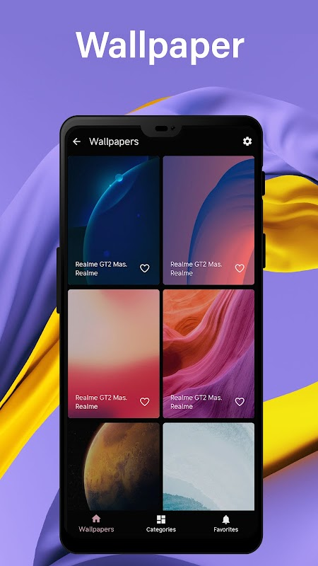
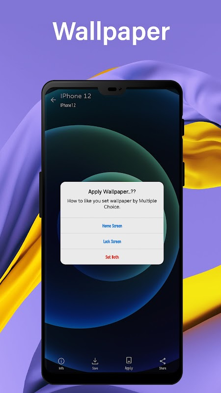

# 🎮 Phone Wallpapers


<p align="center">
  
</p>

### Overview :
Discover a world of stunning visuals with this beautifully designed Phone Wallpaper App, created to personalize your device with high-quality and aesthetic wallpapers.

This app offers a wide collection of wallpapers across multiple categories, ensuring there’s something for everyone—from minimal designs to vibrant artistic backgrounds.

--
## 📱✨ Key Features


🖼️ High-Quality Wallpapers
Access a large collection of HD and 4K wallpapers optimized for all screen sizes.

🎨 Multiple Categories
Browse wallpapers by categories like:

Nature 🌿

Abstract 🎭

Minimal ✨

Dark Mode 🌙

Aesthetic 💫

🔍 Smart Search & Filter
Quickly find wallpapers based on style, color, or theme.

❤️ Favorites Collection
Save your favorite wallpapers for easy access anytime.

📲 One-Tap Apply
Instantly set wallpapers to your home screen or lock screen.

⬇️ Download & Share
Save wallpapers offline or share with friends.

--
## 🎨 Design Highlights

Clean and modern UI

Smooth navigation

Lightweight and fast performance

User-friendly experience


## 🛠 Technologies Used

- Java
- Android Studio
- Android SDK
- XML Layout Design


--
## 🎨 Perfact For

Personalizing your phone

Discovering trending wallpapers

Creating a stylish and unique home screen


## 📸 Screenshots

<p align="center" float="left">

  <p align="center">
  
</p>
<table>
  <tr>
    <td></td>
    <td></td>
    <td></td>
    <td></td>
  </tr>
   <tr>
    <td></td>
    <td></td>
    <td></td>
    <td></td>
  </tr>
 </table>
 


## 📂 Project Structure

```
app/
 ├── java/
 ├── activities/
 ├── models/
 ├── utils/
 └── res/
```


## Final Repository Structure

```
PhoneWallpapers
│
├── app
├── screenshots
├── README.md
└── LICENSE
```


## ⚙ Installation

1. Clone the repository

```
git clone https://github.com/panthitech/phonewallpapers.git
```

2. Open the project in Android Studio

3. Run the app on an Android device or emulator


## 📌 Topics

android • android-game • phone-wallpaper • java • android-studio


## 📜 License

This project is licensed under the MIT - see the [LICENSE](LICENSE) file for details.


## 👩‍💻 Author

**Shraddha Kathiriya**  
Android App Developer  
🌐 GitHub: https://github.com/panthitech
